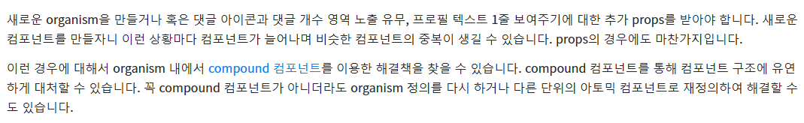
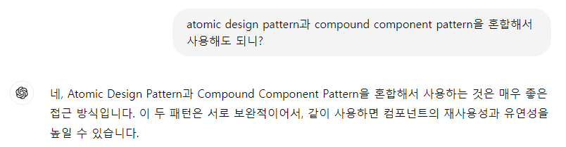

atomic design pattern으로 설계를 하다 보니, compound component pattern을 함께 사용하고 싶은 경우가 생겼다.

그런데 두 패턴을 혼합해서 사용하면 atomic design pattern의 의의에 어긋나는 게 아닌가라는 생각이 들었다.

(compound component의 요소들을 하위 단위의 atomic 컴포넌트로 정의해야 되는 게 아닌지..)

카카오엔터테인먼트 FE 기술 블로그와 ChatGPT를 참고해 보면 두 패턴을 혼합해서 사용하는 게 흔한 방식인 것 같다.

---

카카오엔터 FE 기술 블로그 (https://fe-developers.kakaoent.com/2022/220505-how-page-part-use-atomic-design-system/)

---

GPT‑4o 답변

