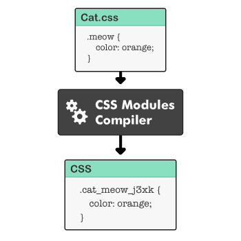
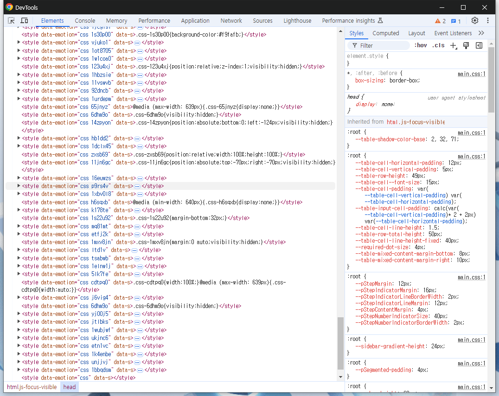

# CSS

## CSS-in-CSS 방식

### CSS Module

- CSS를 모듈화하여 컴포넌트 단위로 관리할 수 있다.
- 모듈 단위로 고유한 className을 만들어 주기 때문에, global namespace 오염을 걱정할 필요가 없다.
- CSS를 만드는 데 있어서 JS를 사용할 수 없기 때문에 디자인 토큰 등, 변수를 체계적으로 관리하기에 어려움이 있다.

## CSS-in-JS 방식

### styled-components, emotion

- CSS Module과 마찬가지로 컴포넌트 단위로 고유한 className을 생성한다.
- JS와 CSS를 한 곳에 작성할 수 있다.
- 동적 스타일링이 가능하다.
- 페이지 로드 시 모든 스타일을 한 번에 등록하지 않고, 필요한 스타일만 `document.styleSheets`에 추가한다.
  (이를 `Critical CSS`라고 한다.)
  그래서 CSS-in-JS (emotion)을 쓰는 사이트를 보면 아래와 같이 `CSSStyleSheet`가 엄청 많은 걸 볼 수 있다.
  

## 차이점

성능과 동적 스타일링 가능 여부가 가장 큰 차이라고 생각한다.

### 성능

일단, CSS-in-JS는 런타임에 CSS를 생성하는 라이브러리가 필요하기 때문에 번들 크기가 커진다.
그리고 퍼포먼스도 상당히 큰 차이가 있다. 일반적으로 CSS-in-CSS 방식이 훨씬 빠르다.

- https://www.samsungsds.com/kr/insights/web_component.html
- https://junghan92.medium.com/%EB%B2%88%EC%97%AD-%EC%9A%B0%EB%A6%AC%EA%B0%80-css-in-js%EC%99%80-%ED%97%A4%EC%96%B4%EC%A7%80%EB%8A%94-%EC%9D%B4%EC%9C%A0-a2e726d6ace6

### 동적 스타일링

emotion, styled-components는 동적 스타일링을 지원한다.
문제는, 새로운 동적 스타일을 만들 때마다 새로운 `CSSStyleSheet`가 추가되기 때문에, 남발하면 성능적으로 큰 문제가 생길 수 있다.
emotion 공식 문서에서도 동적 스타일링에 대한 best practice 소개가 있는데...
https://emotion.sh/docs/best-practices#use-the-style-prop-for-dynamic-styles
inline style로 변수값을 넣어주라는데 매번 이렇게 할 거면 emotion을 쓰는 이유가 없고,
공식 문서에 있는 예제처럼 너무 동적인 스타일에만 위와 같은 방법을 사용하면 될 것 같다.

emotion에 익숙해져 아래와 같은 상황에서 좋은 해결법을 떠올리지 못할 수가 있는데..
`props`로 `backgroundColor` 값을 받는 `Button` 컴포넌트가 있다고 가정해보자..
styled-components나 emotion을 쓴다면 그냥 전달받은 `backgroundColor`값으로 새로운 스타일을 동적으로 생성하면 된다.
하지만, CSS Module 방식을 사용한다면...?
inline으로 넣어주거나😠 utility css 방식을 사용하면😊 해결할 수 있다.

### PandaCSS, Vanilla Extract

CSS-in-CSS 방식은 CSS를 생성함에 있어서 JS를 사용할 수 없기 때문에,
디자인 토큰 등 변수 값을 체계적으로 관리하는 데 어려움이 있었다.
그러나, emotion과 같은 CSS-in-JS 라이브러리를 사용하기에는 성능적으로 너무 큰 단점이 존재한다.
이러한 문제를 해결하기 위해, CSS-in-JS 방식으로 CSS를 작성하고, 빌드 타임에 CSS 파일로 컴파일 해주는 라이브러리가 있다.
(당연히 동적 스타일링은 안 된다.)
성능과 DX를 둘 다 챙기고 싶으면 이러한 라이브러리를 사용하는 게 좋아보인다.
https://panda-css.com/
https://vanilla-extract.style/
