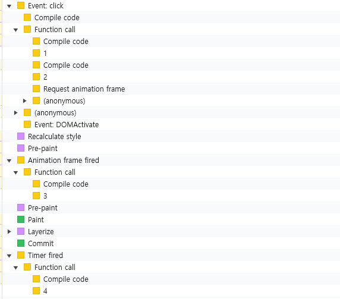

의도적으로 클릭 관련 스타일을 모두 없애도, 버튼을 클릭하는 순간 `Recalculate style`이 발생한다.

```html
<html>
  <head>
    <script>
      function test() {
        performance.mark('1');

        new Promise(() => {
          performance.mark('2');
        });

        requestAnimationFrame(() => {
          performance.mark('3');
        });

        setTimeout(() => {
          performance.mark('4');
        }, 0);
      }
    </script>
  </head>
  <body>
    <button onclick="test()">Test</button>
  </body>
</html>
```

위와 같은 코드를 작성하고 버튼을 클릭하고 Performance 탭을 보면 결과는 아래와 같다.



버튼을 클릭하면 `Recalculate style`이 발생하는 걸 볼 수 있다.

발생 시점이 특이한데 Promise 이후, **requestAnimationFrame 이전**이다.
