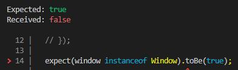

jsdom 환경에서 정의된 window는 브라우저의 Window 객체가 아니라, 테스트를 목적으로 별도로 구현된 객체입니다.

만약 아래와 같은 코드가 있을 때, element에 window를 대입하면 조건문을 통과할 수 없습니다.

```js
if (element instanceof Window) {
	// ...
}
```

## 해결법

```js
expect(Object.create(Window.prototype) instanceof Window).toBe(true);
```

## 더 알아보기

- instanceof의 동작 원리
    - `instanceof` 연산자는 `object`의 프로토타입 체인에 `constructor.prototype`이 존재하는지 판별합니다.
    - 직접 구현한 instanceof
    
    ```js
    const isInstanceof = (object, constructor) => {
      if (object == null) {
    	  return false;
      }
    
    	const prototype = constructor.prototype;
      let proto = Object.getPrototypeOf(object);
    
      while (proto !== null) {
        if (proto === prototype) {
    	    return true;
        }
        proto = Object.getPrototypeOf(proto);
      }
      
      return false;
    };
    ```
    
- Object.create()란?
    - Object.create() 메서드는 지정된 프로토타입 객체 및 속성(property)을 갖는 새 객체를 만듭니다.
    
    ```js
    Object.create(proto[, propertiesObject])
    ```
    

## Reference

- 해결법 (https://stackoverflow.com/questions/62095763/how-to-test-in-jest-for-target-instanceof-window-window)
- instanceof (https://developer.mozilla.org/ko/docs/Web/JavaScript/Reference/Operators/instanceof)
- Object.create (https://developer.mozilla.org/ko/docs/Web/JavaScript/Reference/Global_Objects/Object/create)