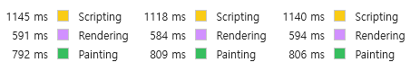
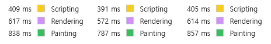
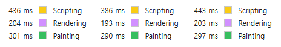

[1.webm](1.webm)

최근에 암호화폐 실시간 시세를 보여주는 사이트를 만들고 있는데, TPS가 500 이상 치솟는 경우가 많다.

당연히, 최적화를 하지 않으면 성능적으로 문제가 발생할 거라 생각했고 실제로 어느정도 차이가 나는지 궁금하여 이를 확인하기 위해 간단한 실험을 하였다.

> **6.5초 동안 3000번의 업데이트**가 발생할 때, 어느 정도 시간이 소요되는지 로직을 차례대로 개선하면서 확인한다.
>
> _(Chrome DevTools Performance 패널을 통해 런타임 성능을 분석하였으며, Production mode에서 확인하였다.)_

---

## 개선 전 로직

1. **모든 종목의 시세를 하나의 상태**에서 관리한다.
2. 개별 종목의 시세 업데이트 정보를 받으면, 상태를 업데이트 한다.
3. 해당 상태를 바탕으로 각 컴포넌트(시세를 보여주는 컴포넌트)마다 props로 전달해준다.

총 3번 테스트했으며, `Scripting` + `Rendering` + `Painting` 시간의 평균값은 2526ms이다.

---

## 1차 개선 - 상태 업데이트 개선하기

1. 모든 종목의 시세를 하나의 상태에서 관리하지 않고, **개별 종목마다 별도의 상태**(전역)를 갖는다.
2. 각 컴포넌트는 시세를 props 대신 전역 상태로부터 전달받는다.

`Scripting` 시간이 기존 로직 대비 35% 수준으로 단축됐다.

시세 정보는 단순히 ticker나 가격만 포함하는 게 아니라 거래량, 52주 신고가 등 다양한 정보를 포함하고 있기에 생각보다 용량이 크다. 종목 수가 153개인데 모든 종목의 데이터가 130KB 가량된다. 그래서 개선 전 로직에서 상태를 업데이트하는 과정에서 많은 `Scripting` 시간이 소요됐을 것이다.

---

## 2차 개선 - 화면에 보이는 부분만 업데이트 하기

1. Viewport 내에 존재하는 컴포넌트만 업데이트를 하도록 변경하였다.

   정확하게 말하자면, 상태 자체는 업데이트하지만, dom에 반영하는 과정을 생략하였다.

   (Viewport 내에 존재하는 컴포넌트는 총 153개 중 42개로, 전체의 27.45%이다.)

기존 로직 대비 `Rendering` + `Painting` 시간이 거의 1/3 수준으로 감소했다.

두 차례의 개선을 거친 결과, `Scripting` + `Rendering` + `Painting` 시간이 2526ms → 917ms로 단축되어, 총 6500ms의 측정 시간 중 1609ms의 idle time을 확보할 수 있었다.

---

## 후기

최적화랑 관련된 로직을 구현할 때마다 드는 생각이 있다.

> ‘컴퓨터가 얼마나 빠른데, 이 정도 최적화 했다고 해서 사용자가 체감하겠어?'
>
> ‘일반적인 상황에서는 오히려 최적화가 독이 되는 상황에서, 극히 드문 최악의 상황을 가정해 최적화를 하는 게 맞을까?’

지금까지 이런 생각을 가지고 있었는데, 이번에 약간 생각이 바뀌었다.

'웬만해선 최악의 경우를 기준으로 최적화를 하는 게 맞지 않을까?'라는 생각이 든다.

일반적인 상황에서 최적화 로직의 오버헤드로 인한 손해보다 최악의 상황/저사양 기기에서 최적화로 얻는 이득이 훨씬 크기 때문…
