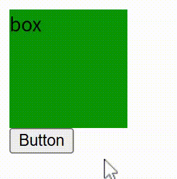
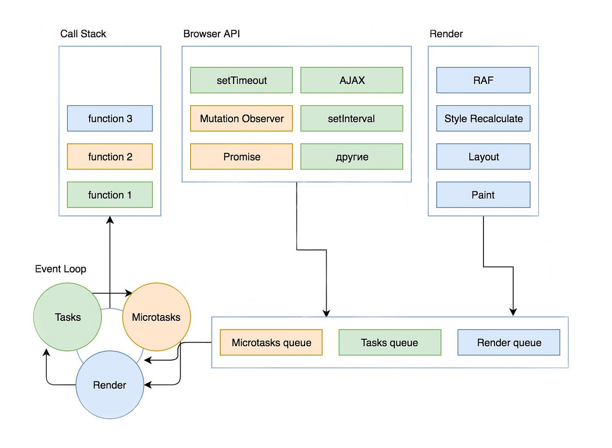
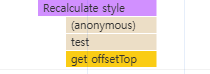
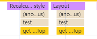
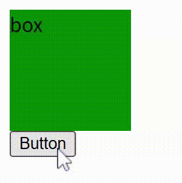
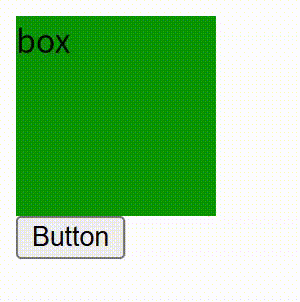

## 문제 상황

```jsx
<html>
  <head>
    <style>
      .box {
        width: 100px;
        height: 100px;

        background-color: green;
      }
    </style>
    <script>
      function test() {
        const $box = document.querySelector(".box");

        $box.style.backgroundColor = "red";
        $box.style.transition = "all 1s";
        $box.style.backgroundColor = "blue";
      }
    </script>
  </head>
  <body>
    <div class="box">box</div>
    <button onClick="test()">Button</button>
  </body>
</html>
```

위와 같은 코드에서 `test()` 를 호출했을 때 box의 background-color가 어떻게 변화될까요?

개발자는 red → blue로 transition이 일어나는 걸 의도했겠지만 결과는 아래와 같이 green → blue로 transition이 됩니다.



## 의도한 것과 결과가 다른 이유

JavaScript로 element의 style을 변경해도 즉시 적용되지 않습니다.

브라우저는 JavaScript의 동기적인 코드가 끝난 뒤 렌더링 과정을 일괄적으로 처리합니다.


## 알려진 해결 방법들

이 문제에 대해 검색을 해보면 몇 가지 해결책을 찾아볼 수 있습니다.

흔히 찾아볼 수 있는 4가지 방법을 정리했습니다.

```jsx
$box.style.backgroundColor = 'red';

// solution 1
setTimeout(() => {
  $box.style.transition = 'all 1s';
  $box.style.backgroundColor = 'blue';
}, 0);

// solution 2
setTimeout(() => {
  $box.style.transition = 'all 1s';
  $box.style.backgroundColor = 'blue';
}, 50);

// solution 3
requestAnimationFrame(() => {
  $box.style.transition = 'all 1s';
  $box.style.backgroundColor = 'blue';
});

// solution 4
$box.offsetTop;
$box.style.transition = 'all 1s';
$box.style.backgroundColor = 'blue';
```

solution 1~4 모두 red → blue로 transition이 발생하여 처음 의도한대로 작동합니다.

하지만 solution 1~3은 항상 작동을 보장하지 않는 잘못된 방법입니다.

## 잘못된 방법인 이유

이유를 알기 위해서는 브라우저의 렌더링이 언제 실행되는지 알아야 합니다.



위 그림처럼 브라우저의 렌더링을 실행하는 Render Queue가 존재합니다.

그림에는 나타나 있지 않아 추가적으로 설명할 내용이 있는데,

1. Microtask Queue > Render Queue > (Macro)Task Queue 순으로 우선 순위를 가집니다.
2. Render Queue의 작업은 매번 Call Stack에 추가되는 것이 아니라 브라우저가 업데이트가 필요하다고 판단하는 순간에만 추가됩니다.

   (일반적으로 주사율에 맞추어 60FPS 기준 16.6ms마다 Render Queue가 비워집니다.)

그리고 한 가지 더 주목할 점은 Style 과정 이전에 RAF (requestAnmationFrame)이 실행되는 것입니다.

저희가 처음 의도한대로 transition이 발생하려면 첫 번째 style 변경과 두 번째 style 변경 사이에 렌더링이 실행되어야 합니다.

이 내용을 바탕으로 solution 1~3이 왜 잘못된 방법인지 확인해 봅시다.

### Solution 1

```jsx
$box.style.backgroundColor = 'red';

// solution 1
setTimeout(() => {
  $box.style.transition = 'all 1s';
  $box.style.backgroundColor = 'blue';
}, 0);
```

setTimeout의 콜백 함수(두 번째 style 변경)가 Task Queue에 추가되고,

Render Queue는 Task Queue보다 우선 순위가 낮기 때문에 옳은 방법처럼 보이지만

Render Queue의 작업은 항상 실행되는 것이 아니라 주사율에 맞추어 실행되기에 현재 setTimeout의 콜백 함수가 다음 렌더링 이후에 실행된다는 보장이 없습니다.

### Solution 2

```jsx
$box.style.backgroundColor = 'red';

// solution 2
setTimeout(() => {
  $box.style.transition = 'all 1s';
  $box.style.backgroundColor = 'blue';
}, 50);
```

Render Queue의 작업이 50ms 동안 실행되지 않는 상황이 드물기 때문에 정상 작동하는 것처럼 보이지만 이것 또한 작동을 보장한다고 보기 어렵고 transition이 지연되어 실행된다는 문제점이 있습니다.

### Solution 3

```jsx
$box.style.backgroundColor = 'red';

// solution 3
requestAnimationFrame(() => {
  $box.style.transition = 'all 1s';
  $box.style.backgroundColor = 'blue';
});
```

requestAnimationFrame은 브라우저 렌더링보다 먼저 실행됩니다. (Style 과정보다 먼저 실행됩니다.)

### Solution 4

```jsx
$box.style.backgroundColor = 'red';

// solution 4
$box.offsetTop;
$box.style.transition = 'all 1s';
$box.style.backgroundColor = 'blue';
```

offsetTop과 같이 레이아웃 연산이 필요한 일부 속성의 값을 가져오면 동기적인 Javascript 코드가 작동 중일 때도 reflow를 발생시킬 수 있고, 이를 통해 브라우저 렌더링을 실행할 수 있습니다.

## reflow 성능 문제

reflow를 사용하는 방법은 괜히 불필요한 연산을 발생시키는, 좋지 않는 방법일 것 같다는 생각이 듭니다.

하지만, 일반적인 생각과 다르게 단순히 offsetTop과 같은 속성을 읽는 것만으로는 reflow(layout) 연산이 발생하지 않습니다.



위 스크린샷처럼 실제로 레이아웃의 변동이 없을 때는 get offsetTop이 발생해도 layout은 발생하지 않습니다.



실제로 레이아웃의 변동이 생겼을 때만 layout이 발생합니다.

## 잘못된 방법이 작동하는 이유

Solution 4가 작동을 항상 보장하는 제대로 된 방법이라는 걸 알았습니다.

하지만 Solution 1~3은 이론적으로 작동하지 않아야 하는 방법인데도 왜 실제로 테스트해보면 red → blue로 transition이 발생하는 걸까요?



이유는 버튼을 클릭하면 Recalculate style이 발생하기 때문입니다.

([https://kimdw524.github.io/post/click-recalculate-style/](https://kimdw524.github.io/post/click-recalculate-style/))



`test()` 함수를 버튼 클릭 핸들러가 아닌, 타이머를 통해 실행하면 Solution 1~3 방법은 green → blue로 transition이 발생하는 걸 확인할 수 있습니다.
